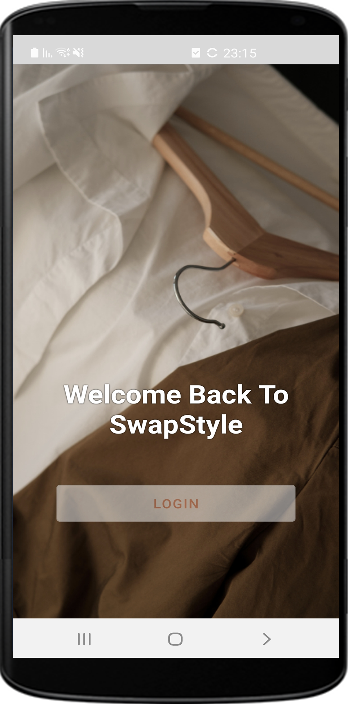
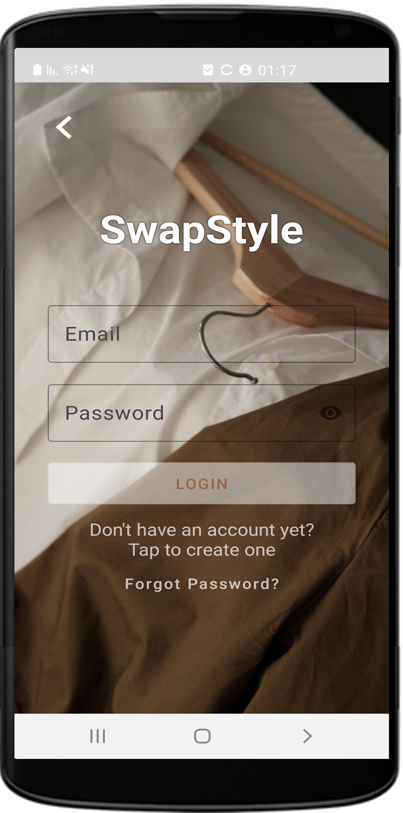
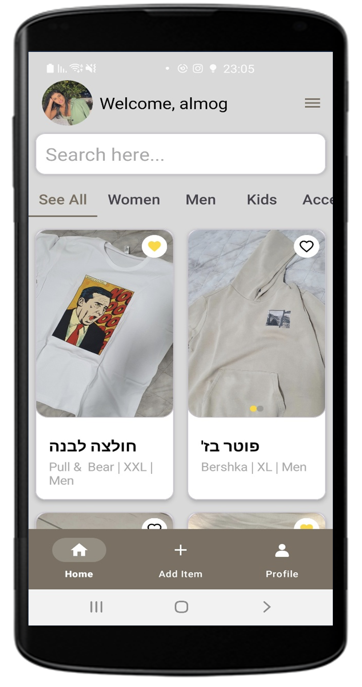
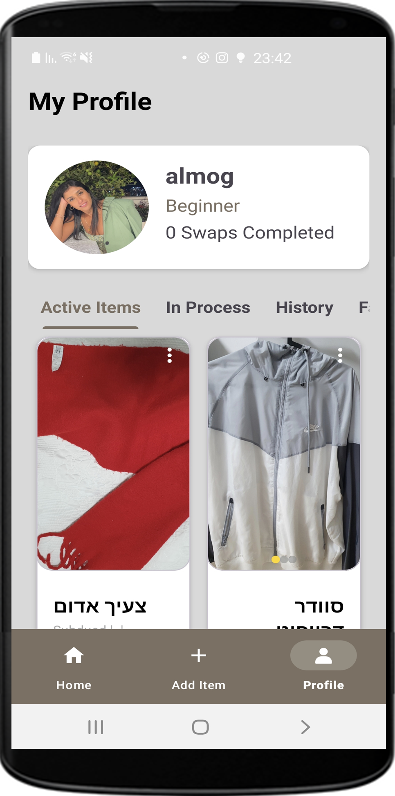
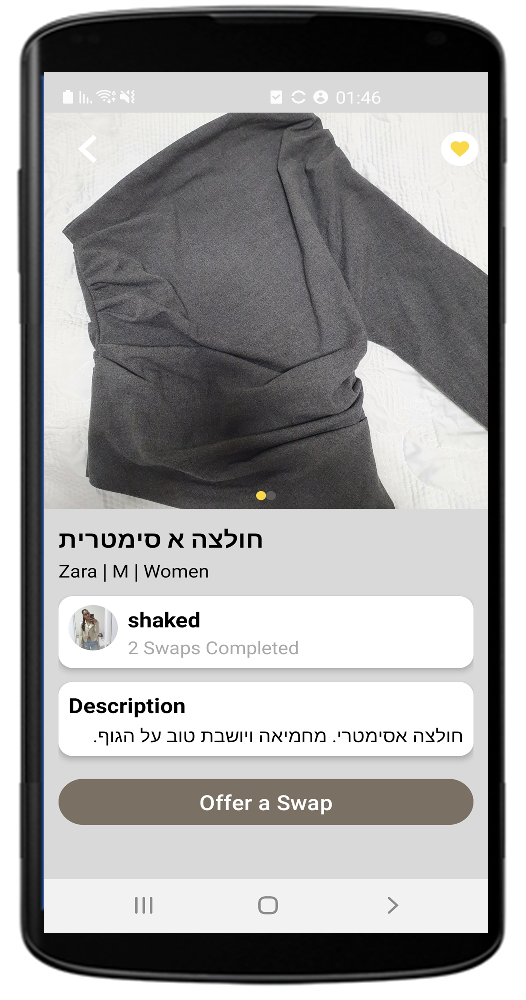
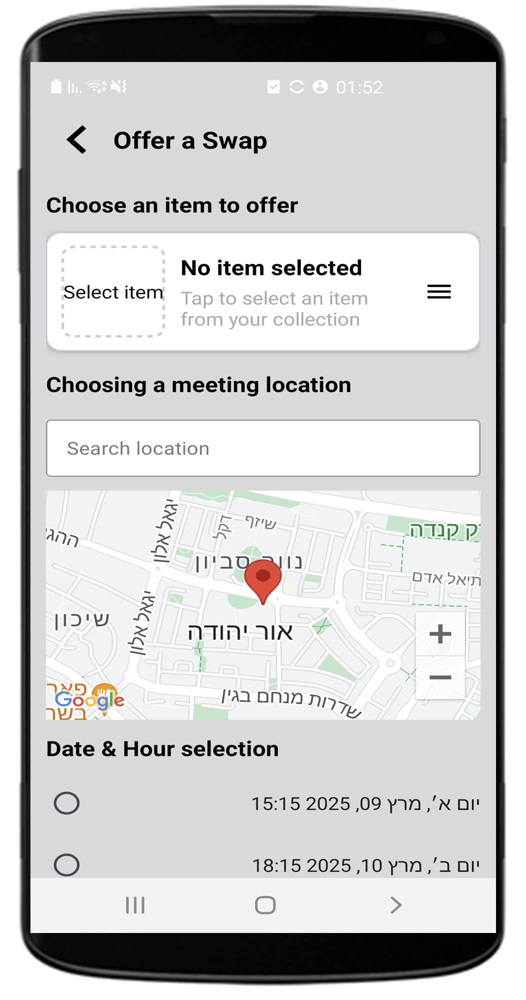
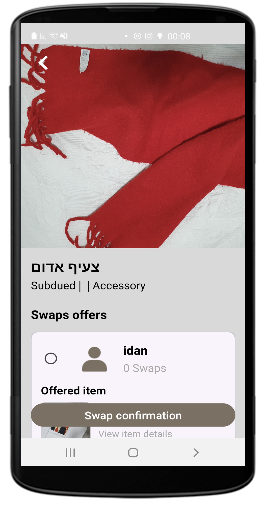
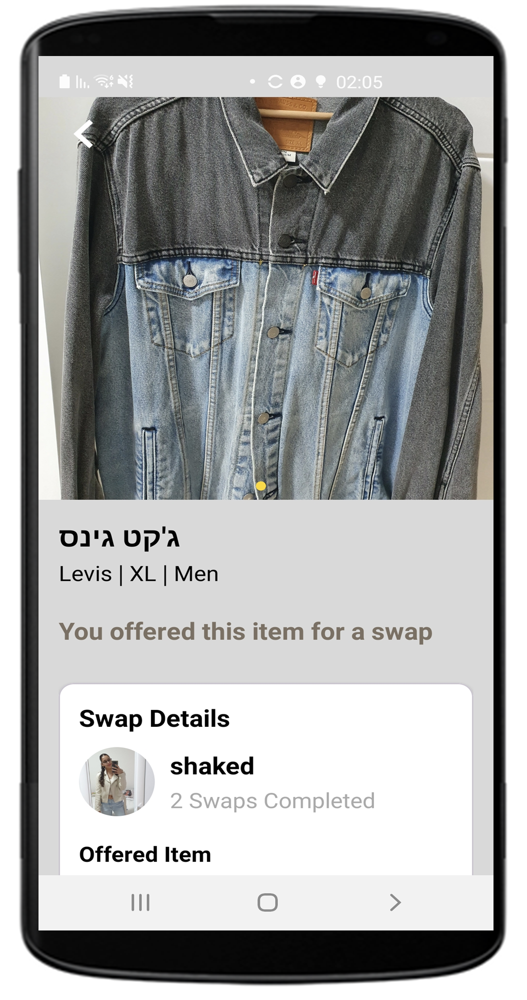
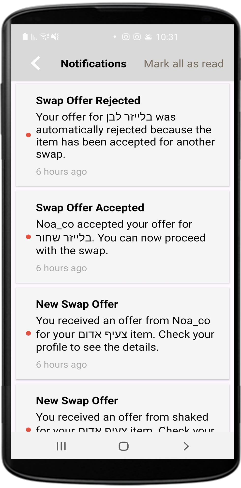

# SwapStyle - Clothing Swap App 

<p align="center">
  
</p>

## 📌 Introduction
SwapStyle is a modern Android application that enables users to swap clothing items with others in their community. The app promotes sustainable fashion by encouraging reuse rather than disposal of clothing items, creating a circular economy for fashion enthusiasts.

This application leverages **Firebase Authentication, Firestore Database, and Firebase Storage** to manage users, items, and swap offers efficiently.

---

## 🚀 Features

### 🔑 User Authentication
• **Sign Up / Login** with Firebase Authentication.  
• **Password Reset** for recovering accounts.  
• **Profile Management** including profile picture updates.

### 👕 Clothing Management
- **Upload clothing items** with images, descriptions, and size details.
- **Categorized browsing** for easy discovery (*Men, Women, Kids, Accessories*).
- **Favorite items** to save them for later.
- **Advanced search** for filtering by *title, brand, category, or size*.
- **Delete items** that are no longer available for swapping.

### 🔄 Swap System
• **Send swap offers** for available items.  
• **Set preferred swap locations & time slots.**  
• **Real-time notifications** for accepted/rejected offers.  
• **Swap history tracking** for completed exchanges.

### 🔔 Notifications System
- **Receive instant notifications** when a swap offer is accepted or rejected.
- **Get notified** when a new message or update is available regarding a swap.
- **Mark notifications as read** to keep track of updates.
- **View all notifications in a dedicated screen** for better organization.

### 🎨 UI/UX Enhancements
• **Smooth animations & transitions** using `AnimationHelper`.  
• **Image picker & cropper** for optimized uploads.  
• **Google Maps API** for location-based swapping.

---

## 📲 User Flow

1️⃣ **User Registration/Login** → Create an account or log in.  
2️⃣ **Profile Setup** → Upload profile picture & set preferences.  
3️⃣ **Add Clothing Items** → Upload images, select category, size, and availability.  
4️⃣ **Browse & Search** → Explore available items by category or keyword.  
5️⃣ **Send Swap Offers** → Select an item, choose yours for exchange, and propose a location & time.  
6️⃣ **Offer Acceptance/Rejection** → Receive responses to swap requests.  
7️⃣ **Real-time Notifications** → Get notified when your swap offer is accepted/rejected.  
8️⃣ **Finalize Swap** → Meet at the agreed location and exchange items.  
9️⃣ **Swap History** → View past exchanges in your profile.

---

## 📸 Screens

### 👋 Welcome Screen
<p align="center">
  
</p>  

### 🔑 Login Screen
<p align="center">
  
</p>

### 🏠 Home Screen
<table>
  <tr>
    <td style="text-align: left; vertical-align: top; width: 60%;">
      <b>The Home Screen allows users to browse available clothing items.</b><br><br>
      🔹 View <b>all listed items</b> from different users.<br>
      🔹 Use the <b>search bar & filters</b> to find specific items.<br>
      🔹 Click on an item to see <b>detailed information & swap options</b>.
    </td>
    <td style="text-align: right; width: 40%;">
      
    </td>
  </tr>
</table>

### ➕ Add Item Screen
<table>
  <tr>
    <td style="text-align: left; vertical-align: top; width: 60%;">
      <b>The Add Item Screen lets users upload clothing items for swapping.</b><br><br>
      🔹 Add <b>photos, title, size, brand, and category</b>.<br>
      🔹 Set the item’s <b>availability status</b>.<br>
      🔹 Click "Save" to add it to the marketplace.
    </td>
    <td style="text-align: right; width: 40%;">
      
    </td>
  </tr>
</table>

### 👤 Profile Screen
<table>
  <tr>
    <td style="text-align: left; vertical-align: top; width: 60%;">
      <b>The Profile Screen displays user information and swap history.</b><br><br>
      🔹 View your <b>uploaded items</b> and manage them.<br>
      🔹 Check <b>sent & received swap offers</b>.<br>
      🔹 Edit your <b>profile picture & details</b>.
    </td>
    <td style="text-align: right; width: 40%;">
      
    </td>
  </tr>
</table>

### 🛍️ Item Details (Consumer)
<table>
  <tr>
    <td style="text-align: left; vertical-align: top; width: 60%;">
      <b>The Item Details Screen (Consumer) shows a specific clothing item.</b><br><br>
      🔹 View <b>item details, images, and owner information</b>.<br>
      🔹 Click <b>"Propose Swap"</b> to offer one of your items in exchange.
    </td>
    <td style="text-align: right; width: 40%;">
      
    </td>
  </tr>
</table>

### 🔄 Swap Offer Screen
<table>
  <tr>
    <td style="text-align: left; vertical-align: top; width: 60%;">
      <b>The Swap Offer Screen lets users send swap requests.</b><br><br>
      🔹 Select an item you want to swap for the displayed item.<br>
      🔹 Choose a <b>meeting location & time slot</b>.<br>
      🔹 Send the request and wait for the owner's response.
    </td>
    <td style="text-align: right; width: 40%;">
      
    </td>
  </tr>
</table>

### 🏠 Item Details (Owner)
<table>
  <tr>
    <td style="text-align: left; vertical-align: top; width: 60%;">
      <b>The Item Details Screen (Owner) lets the item owner manage swap requests.</b><br><br>
      🔹 See <b>who is interested</b> in the item.<br>
      🔹 Accept or reject incoming <b>swap offers</b>.<br>
      🔹 Remove the item if it is no longer available.
    </td>
    <td style="text-align: right; width: 40%;">
      
    </td>
  </tr>
</table>

### ⏳ Item In Process Screen
<table>
  <tr>
    <td style="text-align: left; vertical-align: top; width: 60%;">
      <b>The Item In Process Screen allows users to track an ongoing swap.</b><br><br>
      🔹 View the <b>current status</b> of an item being swapped.<br>
      🔹 See details of the <b>swap partner</b> and meeting arrangements.<br>
      🔹 Cancel the swap if necessary before it’s completed.
    </td>
    <td style="text-align: right; width: 40%;">
      
    </td>
  </tr>
</table>

### 🔔 Notifications Screen
<table>  
  <tr>  
    <td style="text-align: left; vertical-align: top; width: 60%;">  
      <b>The Notifications Screen helps users stay updated on their swap activities.</b><br><br>  
      🔹 View <b>new swap requests, acceptances, and rejections</b> in real time.<br>  
      🔹 Mark notifications as <b>read or unread</b> to track updates.<br>  
      🔹 Keep all swap-related messages in one place.  
    </td>  
    <td style="text-align: right; width: 40%;">  
        
    </td>  
  </tr>  
</table>


## 📂 Project Structure
```SwapStyleProject/
│
├── app/
│   ├── src/
│   │   └── main/
│   │       ├── java/
│   │       │   └── com.example.swapstyleproject/
│   │       │       ├── adapters/             # RecyclerView adapters for displaying data
│   │       │       ├── data/                 # Data layer of the application
│   │       │       │   ├── repository/       # Firebase repository implementations
│   │       │       │   └── model/            # Data classes for items, users, swaps
│   │       │       ├── fragments/            # UI fragments for main screens
│   │       │       ├── ui/                   # Additional UI components
│   │       │       ├── utilities/            # Helper classes and utility functions
│   │       │       └── views/                # Custom view implementations
│   │       │
│   │       ├── res/                          # Android resources
│   │       └── AndroidManifest.xml           
│   │
│   ├── build.gradle.kts                      
│   └── google-services.json                  
│
├── gradle/                                   
├── build.gradle.kts                          
└── README.md                                 
```

---

## 🏗️ Architecture

- **Model:** Data classes representing entities like `ClothingItem`, `User`, `SwapOffer`.
- **Repository:** Data access layer handling communication with Firebase.
- **UI:** Activities and Fragments handling user interaction.
- **Utilities:** Helper classes for common functionality.

---

## 🔐 Permissions

- **Internet access**
- **Camera access**
- **Location access**
- **Storage access (for photos)**

---

## Setup Instructions

1. Clone the repository 
    ```sh 
        git clone https://github.com/almog-hevroni/SwapStyle-App.git
    ```
2. Open the project in Android Studio
3. Open the file res/values/strings.xml and add the API key:
   ```xml
        <string name="google_maps_key">YOUR_API_KEY</string>
   ```
4. Build and run the project


## 🔧 Tech Stack

- **Programming Language:** Kotlin
- **UI Components:** Jetpack Compose, XML
- **Database:** Firebase Firestore
- **Authentication:** Firebase Auth
- **Storage:** Firebase Storage
- **Maps & Location:** Google Maps API
- **State Management:** LiveData, ViewModel
- **Asynchronous Operations:** Kotlin Coroutines


